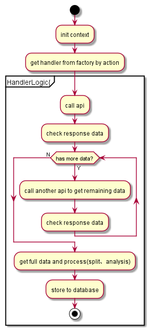

# AmazonScribe
Structure  for  scraping

### API 
list below is from Amazon original website:

*Seller*

| API | maximum request quota| restore rate|
| :-----:| :----: | :----: |
| ListMarketplaceParticipations | 15 | 1 req/minute |
| ListMarketplaceParticipationsByNextToken | 15 | 1 req/minute |

*Report*

| API | maximum request quota| restore rate|
| :-----:| :----: | :----: |
|RequestReport| 15 | 1 req/minute |
|GetReportRequestList| 10 | 1 req/45 second |
|GetReport| 15 | 1 req/minute |

*Order*

| API | maximum request quota| restore rate|
| :-----:| :----: | :----: |
|ListOrders| 6 | 1 req/minute |
|ListOredersByNextToken| 6 | 1 req/minute |
|ListOrderItems| 30 | 1 req/2 seconds |
|ListOrderItemsByNextToken| 30 | 1 req/2 seconds |

*Finance*

| API | maximum request quota| restore rate|
| :-----:| :----: | :----: |
|ListFinancialEventGroups| 30 | 1 req/2 seconds |
|ListFinancialEventGroupsByNextToken| 30 | 1 req/2 seconds |
|ListFinancialEvents| 30 | 1 req/2 seconds |
|ListFinancialEventsByNextToken| 30 | 1 req/2 seconds |

### 领域模型设计

同一个data_collection_info会对应多个task,但同一时刻，只有一个task处于运行状态。（目的：为了方便控制抓取频率和步长）

### 参数配置中心
| field | length | nullable | description | type | example |
| :-----:| :----: | :----: |:----: |:----: |:----:|
| key | 256 | no | 配置唯一标识 | String | 001 |
| channel | 256 | no | 渠道 | String | Amazon |
| group | 256 | no | 配置组唯一标识 | String | 001 |
| action | 256 | no | 对应的API接口 | String | Seller |
| cron | 256 | no | 定时任务cron表达式 | String | 0 0 0 1/7*？ |
| step | 256 | no | 数据采集步长/min | long | 2500 |
| retryTimes | 256 | no | 重试次数 | int | 3 |
| collectionCeil | 256 | no | 离线数据采集上限 | int | 100 |
| collectionFloor | 256 | no | 离线数据采集下限 | int | 0 |
| active | 256 | no | 接口是否开启抓取能力 | boolean | Y |
| maxResultsPerPage | 256 | yes | 每次数据住区页面最大结果 | int | 100 |
| limitPageNum | 256 | yes | 每次最多处理nextToken数目 | int | 5 |

### 创建任务
corn : 0 0 /1 * * * ?

1. 定时任务(1min执行一次)触发去创建不同API对应的定时任务
2. 获取所有active=Y，is_valid=Y, is_running=N的collection
3. 查询参数中心定时任务配置，如果当前endTime已经超过now() - collection_floor，表示数据已经采集完成，不需要创建任务，直接结束
4. 如果没有超过，根据collection_info_id去查task，满足status为INIT,RUNNING，RETRY,按创建时间降序取最新的一条
5. 如果task != null，表示当前已经有任务在执行，直接结束.
6. 如果task == null,创建task，并查询定时任务配置，设置task的startTime，endTime。根据cron计算next_exec_time并设置，最后将task信息入库

### 执行任务
corn : 0 0 /1 * * * ?

1. 定时任务触发，扫描task表，获取所有next_exec_time<=now,status为INIT,RUNNING,RETRY的数据
2. 设置task状态RUNNING
3. 初始化context(获取config,collection等）
4. 如果collection的active=N，设置task的status为TERMINATED，结束
5. 如果collection的isValid=N，设置task的status为TERMINATED，结束
6. 计算next_exec_time并更新
7. 组装参数(包括去iexpbizprod获取store info，从store info里拿到sellerId，token等信息）
8. 执行各个接口对应handler逻辑
9. 如果task执行成功，执行后续处理逻辑，并设置task状态为DONE
10. 如果task执行失败，retryTimes加1，并设置task状态为RETRY

### 单阶段执行任务

1. 通过action从factory中拿到具体的handler
2. 调用Amazon api获取数据，如果response里面存在nextToken，则调用对应的nextToken的api继续获取数据，直到拿到这次请求完整的返回
3. 注意！用 NextToken 調用接口時，有機會出現 NextTokenCorrupted 報錯，這時必項調用原有接口拿取 NextToken 再繼續調用對應接口。例如調用 ListOrderByNextToken 時出現 NextTokenCorrupted 報錯，這時須要調用 ListOrders 接口拿取最新 NextToken，然後使用最新的 NextToken 繼續調用 ListOrderByNextToken。
4. 进行数据处理，包括拆分，解析等，如果发现XML或FlatFile在OB有未映射的字段，需要把未映射的字段放在扩展字段里，确保所有字段数据都可以完整传输
5. 将处理后的数据存到ob
6. 任务执行完成，更新状态，同时更新collection的endTime

### 多阶段执行任务

1. 通过action从factory中拿到具体的handle
2. 调用Amazon接口去请求准备所需数据
3. 休眠5秒(预估值，可进行调整)再调用Amazon接口去校验数据是否准备好，如果没有，调用次数加1，重复该步骤。如果调用次数超过3次，则任务执行失败
4. 如果数据准备好了，调用接口去拿到数据
5. 进行数据处理，包括拆分，解析等, 在解析数据时，如果发现XML或FlatFile在OB有未映射的字段，需要把未映射的字段放在扩展字段里，确保所有字段数据都可以完整传输
6. 将处理后的数据存到ob
7. 任务执行完成，更新状态，同时更新collection的endTime
